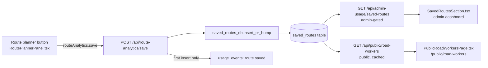

# Road Workers — Saved Routes

This page documents the **"Save this route for road workers"** feature end-to-end:
the button in the route planner, the API that ingests saves, the `saved_routes`
table, the admin analytics dashboard, and the public `/public/road-workers`
page.

The whole thing exists for one purpose: let players nominate the routes they
actually walk so the road-work team can see **where to dig the next tunnel,
where to put a signpost, and which translocators are doing all the work**.

## Index

- [End-to-end flow](#end-to-end-flow)
- [The button](#the-button)
- [Ingest API — `POST /api/route-analytics/save`](#ingest-api--post-apiroute-analyticssave)
- [Database — the `saved_routes` table](#database--the-saved_routes-table)
- [Deduplication & identity](#deduplication--identity)
- [Admin analytics — `GET /api/admin-usage/saved-routes`](#admin-analytics--get-apiadmin-usagesaved-routes)
- [Public page — `/public/road-workers`](#public-page--publicroad-workers)
- [Privacy contract](#privacy-contract)
- [Rate limits & abuse handling](#rate-limits--abuse-handling)

## End-to-end flow



## The button

Lives at the bottom of the translocator route planner:
[frontend/src/components/tops-map/RoutePlannerPanel.tsx](../frontend/src/components/tops-map/RoutePlannerPanel.tsx).
Label: **"Save this route for road workers"**.

### What it sends

The handler flattens the currently displayed `primary` route into a `legs`
array and posts the planner's full result:

```ts
const legs = primary.legs.map(leg =>
  leg.kind === "walk"
    ? { kind: "walk", from, to, seconds, blocks }
    : { kind: "tl",   from, to, seconds, tlId }
);

await routeAnalytics.save({
  from, to, from_label, to_label, legs,
  total_seconds, walk_blocks, tl_hops,
  walk_speed, tl_penalty_seconds, k_neighbors,
});
```

`walk_speed`, `tl_penalty_seconds`, `k_neighbors` are the cost-model knobs the
user had set when they computed the route. They are persisted so the road-work
team can tell whether a "long detour" reflects an actual bad route or just an
unusual cost configuration.

### UX states

The button moves through `idle → sending → sent → idle` with a **4-second
cooldown** on the "Sent — thanks!" label before re-enabling. There is no
explicit per-page client-side throttle beyond that — the server enforces real
limits (see [Rate limits](#rate-limits--abuse-handling)).

### Anonymous saves are allowed

The API client just calls `authHeaders(...)`, which attaches `X-API-Key` if
the user happens to be signed in but does **not** require it. Anonymous
visitors can save routes; their identity collapses to a hashed IP for dedup.

## Ingest API — `POST /api/route-analytics/save`

Source: [backend/app/routes/route_analytics.py](../backend/app/routes/route_analytics.py).
Mounted under `/api` in [backend/app/main.py](../backend/app/main.py).

### Request body

```jsonc
{
  "from":  { "x": -12340, "z": 5678 },
  "to":    { "x":   4500, "z":  220 },
  "from_label": "Home base",          // optional, ≤ 120 chars, control chars stripped
  "to_label":   "Copper mine",        // optional
  "legs": [
    { "kind": "walk", "from": {...}, "to": {...}, "seconds": 42.3, "blocks": 180 },
    { "kind": "tl",   "from": {...}, "to": {...}, "seconds": 5,    "tlId": "abc123" },
    ...
  ],
  "total_seconds": 612.4,
  "walk_blocks":   2480,
  "tl_hops":       3,                 // overwritten server-side from legs if mismatched
  "walk_speed":          1.5,
  "tl_penalty_seconds":  5,
  "k_neighbors":         8
}
```

### Validation (server-side, all rejected with 400/422)

| Limit | Value |
|---|---|
| Coordinate range | ±2 000 000 |
| `legs` length | 1 .. 200 |
| TL hops in `legs` | ≤ 50 |
| `total_seconds` | ≤ 7 days |
| `walk_blocks` | ≤ 10 000 000 |
| `from_label`, `to_label` | ≤ 120 chars, control chars stripped, may be null |

`tl_hops` is always recomputed from the legs — clients can't lie about it.

### What it does, in order

1. **Validate** the payload (coords / legs / totals / labels).
2. **Identify** the actor:
   - Hash the client IP with `_hash_ip` from [backend/app/auth.py](../backend/app/auth.py) (`HMAC-SHA256(IP_HASH_SALT, ip)`).
   - If an `X-API-Key` header is present and valid, resolve it to a user ID.
3. **Rate-limit**:
   - `20 saves / hour` per IP hash (always).
   - `60 saves / hour` per API key (only when signed in — additive, not replacing the IP cap).
4. **Canonicalise the TL chain** into `tl_hop_sequence` (the `"fx,fz>tx,tz|fx,fz>tx,tz|..."` string used for dedup and for the TL-edge analytics). Walk legs are deliberately excluded — only TL hops carry "road workers should look here" signal.
5. **Compute** `route_signature = SHA-1(quantize(from) | quantize(to) | tl_hop_sequence)`, where endpoints are quantized to a 32-block grid so endpoint jitter doesn't fragment dedup.
6. **Insert-or-bump** in `saved_routes` (see next sections). Returns one of `inserted`, `merged`.
7. **On `inserted` only**, mirror a `route.saved` event into `usage_events` so the global Usage timeline counts it once. **Bumps are intentionally not mirrored** to avoid double-counting.
8. Respond:

   ```json
   { "status": "inserted", "save_count": 1 }
   ```

   or

   ```json
   { "status": "merged",   "save_count": 4 }
   ```

## Database — the `saved_routes` table

Created in
[backend/alembic/versions/0021_saved_routes.py](../backend/alembic/versions/0021_saved_routes.py).
Row-level security is enabled on the table.

| Column | Type | Purpose |
|---|---|---|
| `id` | `bigint` PK | autoincrement |
| `created_at` | `timestamptz` | first time this signature was seen for this identity |
| `last_saved_at` | `timestamptz` | most recent save (used for ordering / dedup window) |
| `save_count` | `int` | starts at 1, incremented on dedup hit |
| `actor_api_key_id` | `text` nullable | signed-in identity |
| `ip_hash` | `text` nullable | HMAC-SHA256 of client IP — never raw IP |
| `from_x`, `from_z`, `to_x`, `to_z` | `int` | endpoints |
| `from_label`, `to_label` | `text` nullable | user-facing endpoint names |
| `total_seconds`, `walk_blocks` | `double precision` | totals from the planner |
| `tl_hops` | `int` | derived from `legs` |
| `walk_speed`, `tl_penalty_seconds`, `k_neighbors` | nullable | cost-model knobs that were active |
| `tl_hop_sequence` | `text` | canonical `"fx,fz>tx,tz|..."` TL chain |
| `route_signature` | `varchar(40)` | SHA-1 hash used as the dedup key |
| `legs` | `jsonb` | raw walk + tl leg array |
| `straight_line_blocks` | `double precision` | Euclidean from→to distance |

**Indexes**: `route_signature`, `created_at DESC`, `last_saved_at DESC`,
`(actor_api_key_id, created_at DESC)`, `(ip_hash, created_at DESC)`.

> **`detour_ratio` is not stored.** It is computed at read time as
> `walk_blocks / NULLIF(straight_line_blocks, 0)`.

## Deduplication & identity

Implemented in
[backend/app/core/saved_routes_db.py](../backend/app/core/saved_routes_db.py)
(`insert_or_bump`). The rule is:

> Within a **24-hour window**, the same **identity** saving the same
> **`route_signature`** bumps `save_count` on the existing row instead of
> inserting a new one.

- **Identity** = `actor_api_key_id` if signed in, else `ip_hash`. If somehow
  both are missing (shouldn't happen in production), dedup is skipped and
  every save inserts a fresh row.
- **Dedup window** = `DEDUP_WINDOW_HOURS = 24`. Older matching rows are
  **not** bumped — a fresh insert is made instead, so a resurgence in
  popularity months later shows up as a new row rather than mutating an
  ancient one.
- The lookup uses `SELECT … FOR UPDATE` to serialize concurrent saves of the
  same route by the same identity.
- The signature quantises endpoints to a **32-block grid**
  (`SIGNATURE_QUANTIZE_BLOCKS = 32`) before hashing — so a route saved twice
  from "the same chunk-ish area" dedups, but moving to a different region
  doesn't.

### Why walk legs are excluded from the signature

A route that "uses TL A → TL B and then walks 200 blocks east" and one that
"uses TL A → TL B and then walks 200 blocks west to a different mine" should
still tell the road-work team **"a lot of people leave TL B"**. Excluding
walks from `tl_hop_sequence` means the top-TL-edge counts reflect real
through-traffic on the TL network instead of fragmenting on every distinct
walk destination.

## Admin analytics — `GET /api/admin-usage/saved-routes`

Source:
[backend/app/routes/admin_usage.py](../backend/app/routes/admin_usage.py).
Gated by `Depends(require_admin)`. Rendered by
[frontend/src/components/admin/usage/SavedRoutesSection.tsx](../frontend/src/components/admin/usage/SavedRoutesSection.tsx).

### Query parameters

| Param | Default | Notes |
|---|---|---|
| `from`, `to` | required | ISO timestamps |
| `granularity` | `day` | one of `hour` / `day` / `week` |
| `top_limit` | `25` | 1..100; applies to `top_routes`, `top_tl_edges`, `top_start_hops` |
| `recent_limit` | `50` | how many event rows in `recent` |
| `recent_offset` | `0` | pagination for `recent` |
| `heatmap_cell` | `128` | bucket size in blocks for the heatmap; clamped 16..1024 |

### Response shape

```jsonc
{
  "summary":          { total_saves, distinct_routes, distinct_identities, avg_detour_ratio },
  "timeline":         [{ bucket, saves, distinct_routes }, ...],
  "top_routes":       [{ saves, from, to, from_label, to_label, total_seconds, walk_blocks, tl_hops, detour_ratio }, ...],
  "top_tl_edges":     [{ edge, from, to, saves }, ...],
  "top_start_hops":   [{ edge, from, to, saves }, ...],
  "endpoint_heatmap": { cell_blocks, from: [{x,z,saves}], to: [{x,z,saves}] },
  "recent":           [{ id, last_saved_at, actor_api_key_id, ip_hash_short, from, to, from_label, to_label, total_seconds, walk_blocks, tl_hops, save_count }, ...]
}
```

### How each section is computed

All queries live in `saved_routes_db.py`:

| Section | Query (essence) |
|---|---|
| `summary` | One `SELECT` over the window: `SUM(save_count)`, `COUNT(DISTINCT route_signature)`, `COUNT(DISTINCT COALESCE(actor_api_key_id, ip_hash))`, `AVG(walk_blocks / NULLIF(straight_line_blocks, 0))`. |
| `timeline` | `date_trunc(granularity, last_saved_at) AS bucket, SUM(save_count), COUNT(DISTINCT route_signature)` grouped by bucket. |
| `top_routes` | CTE aggregates by `route_signature` (`SUM(save_count)`, `MAX(last_saved_at)`), then `LATERAL JOIN` back to the most-recent row in each group for representative labels/totals. `detour_ratio = walk_blocks / straight_line_blocks` computed in SQL. |
| `top_tl_edges` | `unnest(string_to_array(tl_hop_sequence, '|'))` explodes one row per TL edge, then `SUM(save_count) GROUP BY edge` and parses the `fx,fz>tx,tz` string back into `from` / `to`. |
| `top_start_hops` | `split_part(tl_hop_sequence, '|', 1)` — the **first** TL edge of each route. Tells you which TL people leave from at the start of their journeys. |
| `endpoint_heatmap` | Two queries (one for `from`, one for `to`): bucket coords into `cell × cell` blocks via integer division `(from_x / cell) * cell`, then `SUM(save_count) GROUP BY bucket`. |
| `recent` | `ORDER BY last_saved_at DESC LIMIT ? OFFSET ?`. Each row exposes `ip_hash_short = ip_hash[:12] + "…"` — admins **never** see the full hash. |

The admin dashboard component reshapes `timeline` into a stacked-series chart
(one series for "saves", one for "distinct routes") — see
[SavedRoutesSection.tsx](../frontend/src/components/admin/usage/SavedRoutesSection.tsx).

## Public page — `/public/road-workers`

A read-only, unauthenticated dashboard that any visitor can hit. The route is
**unlisted** in the main navigation; players reach it by sharing the URL or
following links from contributors.

- **Page component**: [frontend/src/pages/public/PublicRoadWorkersPage.tsx](../frontend/src/pages/public/PublicRoadWorkersPage.tsx)
- **Route**: registered at `/public/road-workers` in [frontend/src/components/AppContent.tsx](../frontend/src/components/AppContent.tsx)
- **Backend**: [backend/app/routes/public_road_workers.py](../backend/app/routes/public_road_workers.py) (`GET /api/public/road-workers`)

### What you see

In order, the page renders:

1. **Header + window selector** — drop-down of `7 / 30 / 90 / 180` days. Default is **30 days**.
2. **Four KPI cards** — total saves, distinct routes, distinct players, average detour ratio.
3. **Most popular saved routes** — table with saves, from/to (label + coords), travel time, walk blocks, TL hops, detour ratio.
4. **Most popular TL connections** + **Most popular first-hop TLs** — two side-by-side `EdgeBlock` tables.
5. **Endpoint heatmap** — two horizontal-bar lists (start cells, destination cells), bucketed at 128-block resolution, top 15 per side. No actual map canvas — it's a textual bar chart.

### Differences from the admin endpoint

| | Admin | Public |
|---|---|---|
| Auth | `require_admin` | none |
| Date range | arbitrary `from` / `to` | `days` only (1..180) |
| Granularity | configurable (`hour`/`day`/`week`) | hard-coded `day` |
| `top_limit` | 1..100 | hard-coded 30 |
| `heatmap_cell` | 16..1024 | hard-coded 128 |
| `recent` events | included (with `ip_hash_short` + `actor_api_key_id`) | **dropped entirely** |
| Labels | full (up to 120 chars) | clamped to 60 chars via `_redact_route` |
| Cache | per-bundle in-memory | in-process, **120 s TTL**, keyed on `days` only, max 32 entries |
| Rate limit | admin auth gating | **60 req/min/IP** |

The public endpoint runs each route row through `_redact_route`, which strips
everything except saves / from / to / labels / times / hops / detour. There
is no path on the public endpoint that exposes an actor key or any form of
the IP hash.

## Privacy contract

Documented to users in section 4d of
[frontend/src/pages/PrivacyPage.tsx](../frontend/src/pages/PrivacyPage.tsx).
Mechanically:

- **Raw IPs are never stored.** `_hash_ip` in
  [backend/app/auth.py](../backend/app/auth.py) returns
  `HMAC-SHA256(IP_HASH_SALT, ip).hexdigest()`. The HMAC salt is mandatory —
  without it, an attacker with table access could rainbow-table the entire
  IPv4 space.
- The full `ip_hash` column is **only** used for dedup grouping and per-IP
  rate-limiting. It is not exposed by any read endpoint.
- The admin "recent saves" table exposes `ip_hash_short = ip_hash[:12] + "…"`
  — enough to recognise "same anonymous user saved 5 routes back-to-back"
  without giving admins back the full digest.
- The public `/public/road-workers` endpoint does not expose `ip_hash` in
  any form, nor `actor_api_key_id`, nor a per-event `recent` feed.
- The `usage_events.route.saved` mirror records `ip_hash` (full) but no
  endpoint surfaces it back outside of admin-gated views.

### Rotating `IP_HASH_SALT`

If you rotate `IP_HASH_SALT` you **lose the ability to dedup against rows
saved with the old salt** — every save by a previously-seen anonymous user
will look new for 24h. Existing rows are not migrated; they just become inert
for dedup purposes (the row remains valid as an analytics data point). Don't
rotate the salt casually.

## Rate limits & abuse handling

| Scope | Limit | Where |
|---|---|---|
| Save by IP | 20 / hour | `route-analytics.py` → `check_scoped_rate_limit(ip_hash, "route-analytics-save", 20, 3600)` |
| Save by API key (when signed in) | 60 / hour | `…("route-analytics-save-key", 60, 3600)` |
| Public dashboard read | 60 / minute / IP | `public_road_workers.py` → `check_scoped_rate_limit(ip_hash, "public-road-workers", 60, 60)` |

The IP cap applies to **everyone**, signed in or not — the per-key cap is
additive on top, not a replacement. A signed-in user therefore cannot bypass
the 20/hr per-IP cap by shouting from multiple sessions sharing one
connection.

### What dedup buys you against abuse

Spamming the button does **not** inflate `total_saves` past 1 per
`(identity, route_signature)` per 24h — repeat clicks just bump `save_count`
on the same row. The analytics use `SUM(save_count)`, so a single user
clicking 50 times shows as `save_count = 50` on one row, not as 50 distinct
saves and not as 50 distinct routes.

This is why `summary.distinct_routes` and `summary.distinct_identities` are
the honest popularity signals — `total_saves` is the looser "enthusiasm"
metric.
